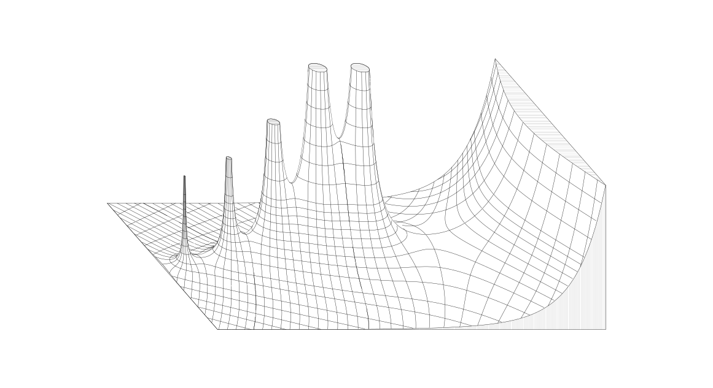

# kurven

A Python library for rendering **analytic landscapes** — the 3D surface visualization of complex functions pioneered by Jahnke and Emde in their 1909 atlas *Tafeln höherer Funktionen*. The height of the surface at each point z is |f(z)|; magnitude and phase contour lines are projected onto the surface and clipped against a depth buffer to produce a hidden-line-removed vector graphic.

## Gallery

### Γ(z) — Gamma function



The upper half-plane Re(z) ∈ [−4.5, 4.5], Im(z) ∈ [0, 2.5]. Four pole spires rise at the non-positive integers; the surface is truncated at a consistent height per spire so each cap is visible from above.

---

### cn(z, m) — Jacobi elliptic function


The doubly periodic function cn(z, m = 0.64). One fundamental tile [−K, 0] × [−K′, 0] is sampled and reflected across the quarter-period lattice to fill a 3×6 plate; a spire rises at each tile corner where cn has a pole, every surface truncated at |cn| = 4 so the caps read from above. Magnitude and phase contours are draped over the landscape and hidden-line-clipped against a depth buffer meshed from the surface itself — the clamped |cn| heightfield plus the vertical cut-face walls — so the front-left cutout, which exposes the cross-section through one spire, occludes what lies behind it.

---

## Algorithm

The pipeline has six stages: **sample → contour → lift → project → depth-buffer → clip**.

### 1. Sample

Evaluate f(z) on a uniform grid of complex values. For functions with poles or rapid variation (e.g. Γ near the negative integers), an **adaptive sampler** (`kurven/sampling.py`) first probes a coarse grid to locate high-gradient regions via |∇ log|f||, then re-samples those zones at a finer density. This concentrates resolution where contours are densest without paying for it everywhere.

### 2. Contour

Extract iso-lines of |f(z)| and arg(f(z)) at a chosen set of levels using marching squares (via [contourpy](https://contourpy.readthedocs.io/)). Two families of curves are generated — magnitude and phase — each at major and minor spacings. The contourpy threaded backend parallelizes across levels; chunk-boundary seams are stitched by exact endpoint matching (`_stitch_chunk_seams`).

For functions with adaptive sampling, coarse contours that fall inside a fine zone are dropped; fine contours fill in. Where a coarse and fine path meet at a zone boundary they are welded together (`_stitch_paths`).

### 3. Lift to 3D

Each contour vertex (x, y) in the complex plane is lifted to (x, y, |f(x + iy)|). This turns the flat contour diagram into a network of curves draped over the magnitude surface.

### 4. Project

An isometric-style projection:

1. **Shear** — y′ = y + s·x (default s = 0.5) introduces foreshortening perpendicular to the viewer, matching the visual style of the original Jahnke-Emde plates.
2. **Rotate** — a Z rotation followed by an X rotation tilts the surface toward the viewer.

The result is a 3D point cloud in screen space.

### 5. Depth buffer

The magnitude surface is independently meshed as a triangulated grid and rasterized into a Z-buffer (`kurven/zbuffer.py`). Each pixel stores the maximum depth value seen so far. A GPU path via [moderngl](https://moderngl.readthedocs.io/) rasterizes with `GL_MAX` blending; the CPU fallback rasterizes triangle-by-triangle using barycentric interpolation.

### 6. Clip and outline

**Hidden-line removal** (`clip_hidden_lines`): each contour point is checked against the Z-buffer. Points behind the surface are invisible; the remaining runs are split into visible segments.

**Silhouette** (`extract_outline`): the Z-buffer is binarized (filled vs. empty) and the level-0 contour gives the outer boundary of the rendered shape — the "picture frame" silhouette.

Both are saved as SVG polylines via matplotlib.

---

## Project structure

```
kurven/
  sampling.py    — uniform + adaptive grid evaluation, gradient-zone discovery
  contours.py    — marching-squares extraction, seam stitching, path lifting
  surface.py     — the sampled |f| landscape; contour lifting, heightfield mesh
  perimeter.py   — a boundary outline: walls, ground ink and mask from one definition
  occluder.py    — heightfield + wall curtains, tiled, as one mesh
  scaffold.py    — the drawn structural line-work (the ink twin of occluder.py)
  projection.py  — isometric shear + rotation
  zbuffer.py     — Z-buffer class, CPU and GPU triangle rasterizers
  outline.py     — hidden-line clipping, silhouette extraction
  scene.py       — Scene: the camera-independent half of a plate
  bundle.py      — the .kurven bundle: typed manifest + npy arrays
  export.py      — python -m kurven.export: a Scene, serialized
  pipeline.py    — thin convenience wrapper for the generic stages

examples/
  gamma.py       — Γ(z): faithful reproduction of the Jahnke-Emde gamma plate
  elliptic.py    — cn(z, m): Jacobi elliptic function landscape
  zeta.py        — ζ(s): Riemann zeta function
  recip_factorial.py — 1/Γ(z): the reciprocal-factorial relief

KurvenSwift/     — the Swift/Metal frontend (see below)
  KurvenCore/    — pure values: spaces, camera, navigation, npy, clip, SVG
  KurvenMetal/   — the depth pass, the preview, the resource cache
  KurvenBake/    — scene -> strokes; tiling; PNG
  kurven-cli/    — bake, preview, depth, bench, inspect, contract
  kurven-test/   — the Swift lane of the tests (an executable, not swift test)
  KurvenApp/     — the window
scripts/
  bundle-app.sh  — assembles Kurven.app (no Xcode required)
tests/
  make_fixtures.py  — writes tests/fixtures, the oracle both lanes are held to
  check_bundle.py   — the Python lane of the contract tests
  compare_bake.py   — end-to-end: the Swift bake against the Python plate
  verify_refactor.py — pixel-identical before/after diffing for refactors
```

## Installation

```bash
uv sync            # CPU only
uv sync --extra gpu  # + moderngl for GPU rasterization
```

## Running the examples

```bash
# Gamma (default: res=10000, buffer=20000 — takes ~10 min on CPU, ~1 min with GPU)
python examples/gamma.py --gpu

# Smoke-test at lower res
python examples/gamma.py --res 800 --buffer 1600

# Elliptic cn
python examples/elliptic.py --gpu

# Both write <prefix>_hi_res.svg (and gamma also writes <prefix>_raw.svg)
python examples/gamma.py --gpu --output-prefix out/my_gamma
```

## The camera seam, and the Swift frontend

The pipeline divides cleanly in two, and not where you would expect. The seam
is not "library versus application" but **camera-independent** work (sample →
contour → lift) versus **camera-dependent** work (project → depth-buffer → clip
→ ink). The first half is the expensive one, needs scipy, and does not change
when you move the camera; the second half is cheap and must run again for every
new viewpoint.

Each example is split at that seam: `build_scene()` returns a
`kurven.scene.Scene` — everything a plate is before anyone decides how to look
at it — and `render_plate(scene, projection)` draws it. `main()` is their
composition, so the plates are unchanged.

A **`.kurven` bundle** is a `Scene`, serialized: a directory holding a typed
`manifest.json` and `.npy` arrays.

```bash
python -m kurven.export recip    -o recip.kurven --res 1600
python -m kurven.export elliptic -o elliptic.kurven --res 2000
python -m kurven.export zeta     -o zeta.kurven
python -m kurven.export recip    -o recip.kurven --derived   # describe, don't dump
```

`--derived` writes descriptions instead of arrays wherever it can. The walls
become a perimeter and a contour layer becomes the levels it is a contour of, so
the consumer regenerates both from `height.npy` and `phase.npy`. recip's bundle
then contains no contour vertices at all and elliptic's drops from 115 MB to
63 MB. Not every layer can be described — elliptic's phase contours are trimmed
by a rule written for that one plate, and those stay dumped, which the schema
says rather than hides.

Describing a layer is also what makes its level set editable: a bundle exported
with `--derived` gets a levels slider per contour layer in the app, and one
without does not.

Bundle arrays are in world order — `x = real`, `y = imag`, `z = |f|` — which is
*not* the `(imag, real, z)` column order the library carries internally. The
exchange happens in one function (`kurven.bundle.swap_to_world`) and the
convention is written into the manifest, because forgetting it is the single
most common bug in this codebase's history.

`KurvenSwift/` reads bundles and does the camera-dependent half in Swift and
Metal — realtime navigation means every camera-dependent stage runs per frame.
It is a pure SwiftPM package with no third-party dependencies and no Xcode
requirement: shaders compile at runtime from a string, and the test suite is an
executable rather than a `.testTarget` (Command Line Tools ships
`Testing.framework` without a `.swiftmodule`).

```bash
swift build -c release --package-path KurvenSwift
KurvenSwift/.build/release/kurven-cli bake recip.kurven -o recip.svg
KurvenSwift/.build/release/kurven-cli inspect recip.kurven
KurvenSwift/.build/release/kurven-cli bench recip.kurven   # per-frame depth cost
```

Build release for anything larger than a smoke test: the readback and the clip
are tight scalar loops, and unoptimized Swift bounds-checks every element of a
several-hundred-megabyte buffer.

GPU resources are keyed on `Scene.content`, which survives a camera change, so
navigation costs one uniform upload plus the depth pass — 1.6 ms for recip and
5.9 ms for zeta at 1024², against 33 ms of redundant heightfield upload per
frame if they were rebuilt. `kurven-cli bench` measures it.

A GPU depth test *is* hidden-line removal, so the realtime preview and the exact
bake are the same computation at two resolutions. The preview draws the depth
pass, then tests each line fragment against it; the bake reads the same depth
back and clips line vertices against it with exactly the semantics of
`outline.clip_hidden_lines`. The only difference is per-fragment versus
per-vertex, which can disagree on runs shorter than a pixel and nowhere else.

### The app

```bash
scripts/bundle-app.sh                    # assembles build/Kurven.app
open -a build/Kurven.app recip.kurven    # or double-click the bundle
```

Left-drag orbits, shift-drag pans, scroll zooms toward the cursor, double-click
re-targets the turn onto the point you clicked, `f` fits, `1`/`2`/`3` switch
between the plate, a shaded surface, and the raw depth buffer. The inspector
carries the camera as numbers, the plate presets, per-layer visibility and
levels, the hidden-line margin, and a bake panel.

Navigation is a pure function: input handling produces `Gesture` values and
`Navigator.applying` folds them, so orbit, pan, zoom and re-target are tested
without a window (`swift run kurven-test`). The app is scriptable for the same
reason it is testable:

```bash
Kurven.app/Contents/MacOS/Kurven recip.kurven --screenshot out.png
Kurven.app/Contents/MacOS/Kurven recip.kurven --bake out.svg --resolution 4000
```

The second is how "the app bakes what the CLI bakes" is checked — it is the
same `Scene` value through the same function, and the two SVGs are byte-identical.

Frame times, full preview at 3200² (`kurven-cli bench`): recip 2.2 ms, elliptic
6.8 ms, zeta 12.1 ms. The cost is vertex-bound rather than fill-bound, so it
barely moves between 1600² and 3200².

### Testing across the two lanes

```bash
scripts/check.sh            # everything, both lanes
scripts/check.sh --quick    # skip the end-to-end comparisons
```


Correctness is anchored on the Python pipeline as oracle. `tests/make_fixtures.py`
writes `tests/fixtures/`; both lanes read the same files.

Or a piece at a time:

```bash
python tests/make_fixtures.py          # regenerate the oracle
python tests/check_bundle.py           # python lane: schema, CSR, camera, clip
swift run --package-path KurvenSwift kurven-test     # swift lane, same fixtures
python tests/compare_bake.py recip     # end to end: swift bake vs python plate
python tests/compare_bake.py recip --derived   # and derived vs dumped
python tests/compare_preview.py recip  # and the preview, as pixels
```

The cheapest test is the sharpest: a fixture manifest decoded by Swift and
re-encoded must come back byte for byte. That is the only check that the two
schema definitions agree, and it is why the Swift mirror needs no codegen.

## References

- Jahnke, E. & Emde, F. (1909). *Tafeln höherer Funktionen*. Teubner.
- Needham, T. (1997). *Visual Complex Analysis*. Oxford University Press.
