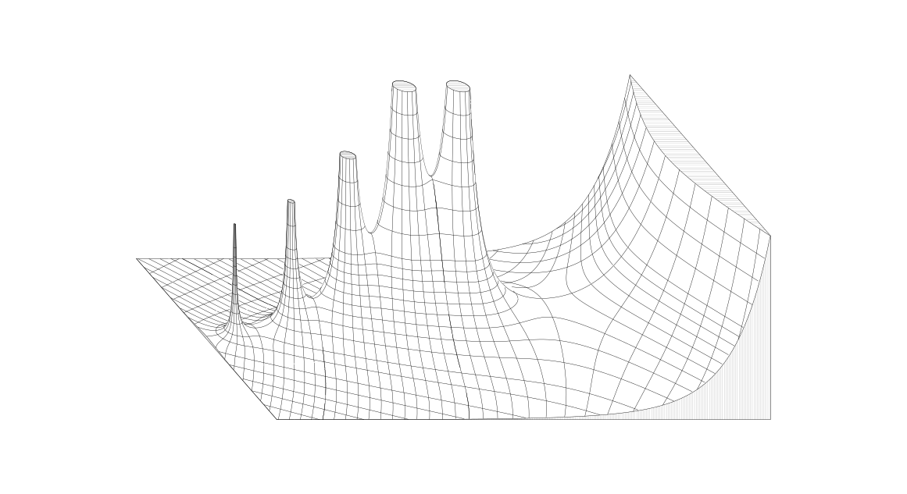

# kurven

**Analytic landscapes**, drawn from the formula alone. Jahnke and Emde's 1909
atlas *Tafeln höherer Funktionen* drew the surface |f(z)| over the complex
plane, with the contours of magnitude and phase draped over it and everything
behind the surface left out. kurven reproduces those plates: f is evaluated,
contoured, lifted onto its own surface, projected the way the plates were
projected, and clipped against a depth buffer of the surface. The result is a
vector drawing, every line of it a level set of f, with nothing in it that was
not computed.

Two implementations draw the same picture. The **Swift and Metal** side is the
app, the CLI, the realtime preview and the exact bake; it samples any
expression natively and depends on nothing. The **Python** side is the
original, and is now the oracle: it writes the fixtures the Swift lane is held
to, bundle for bundle and vertex for vertex, and the four published plate
programs still live there. Where the two differ, the difference is measured
and written down (see *[Testing across the two
lanes](#testing-across-the-two-lanes)*).

The published plates are reproductions — each one a program that knows its
function, its window and where to cut its poles. **Landscapes you choose** are
the general form of the same thing: pick a function (or write one), drag the
window and the truncation, and the plate follows. See *[Landscapes you
choose](#landscapes-you-choose)*.

## Gallery

### Γ(z) — Gamma function



The upper half-plane Re(z) ∈ [−4.5, 4.5], Im(z) ∈ [0, 2.5]. Four pole spires rise at the non-positive integers; the surface is truncated at a consistent height per spire so each cap is visible from above.

---

### cn(z, m) — Jacobi elliptic function


The doubly periodic function cn(z, m = 0.64). One fundamental tile [−K, 0] × [−K′, 0] is sampled and reflected across the quarter-period lattice to fill a 3×6 plate; a spire rises at each tile corner where cn has a pole, every surface truncated at |cn| = 4 so the caps read from above. Magnitude and phase contours are draped over the landscape and hidden-line-clipped against a depth buffer meshed from the surface itself — the clamped |cn| heightfield plus the vertical cut-face walls — so the front-left cutout, which exposes the cross-section through one spire, occludes what lies behind it.

---

## Algorithm

The pipeline has six stages: **sample → contour → lift → project → depth-buffer → clip**.
The ink and the occluder travel separately and meet only at the last stage:
the contours never know about the surface as a mesh, and the mesh never knows
about the contours. That separation is what lets the first three stages run
once per function and the last three run once per frame (see *[The camera
seam](#the-camera-seam-and-the-swift-frontend)*).

### 1. Sample

Evaluate f(z) on a uniform grid over the window. Poles make the interesting
places the expensive ones: the Python plates answer that with an **adaptive
sampler** (`kurven/sampling.py`) that probes a coarse grid for high-gradient
regions via |∇ log|f|| and re-samples those zones finely; the native side
samples one grid and moves the contours onto f afterwards instead (see
*[Contours placed by f](#contours-placed-by-f)*).

### 2. Contour

Marching squares over the grid, for |f(z)| and for arg f(z), each at major and
minor levels. Python uses [contourpy](https://contourpy.readthedocs.io/) and
stitches its chunk seams by exact endpoint matching; Swift has its own walker
(`Contour`), in scan order so a grid gives the same lines every run. A phase
grid wraps at ±π, and marching squares emits a crossing for every level along
the wrap line; the refiner recognises those as wraps and drops them.

### 3. Lift to 3D

Each contour vertex (x, y) is lifted to (x, y, |f(x + iy)|), on the grid's
heights, so the ink lies on the surface that will be drawn rather than on the
one f describes. Under a cap the lift is clamped, and a run that reaches the
cap is carried to the rim rather than ending at its last vertex under it.

### 4. Project

The plates are **oblique parallel projections**, not isometric ones. The
imaginary axis is sheared along the real one in the ground plane, then a
rotation about z and a tilt about x turn the surface toward the viewer. The
real axis lands horizontal on the paper, the |f| axis vertical and at true
length, and the imaginary axis recedes at a slant. Each plate has its own
slant; measured on the paper, relative to the vertical:

| plate | real axis | imaginary axis |
|---|---|---|
| Γ, 1/Γ | 1.22 | 0.93 at 49° |
| cn | 1.12 | 0.77 at 42° |
| ζ | 0.76 | 0.26 at 135° |

A textbook cabinet projection is 1.00 and 0.50 at 45°, cavalier 1.00 and 1.00
at 45°; the plates sit between them, with the real axis stretched, which is
the look no isometric drawing has. The three numbers a plate stores (`shear`,
`xAngle`, `yScale`, with `zAngle` always −90) are that family in other
coordinates: with the azimuth fixed, any receding angle, receding length and
real-axis length is reachable, and so is a true isometric or a cabinet
drawing. In the app the projection is the plate camera with its two angles
made adjustable, so a preset is a starting point for navigation rather than a
fixed picture.

### 5. Depth buffer

The surface is meshed as a triangulated grid and rasterized into a Z-buffer
holding, per pixel, the greatest view depth seen. On the GPU that is `MAX`
blending into a float32 colour attachment, in Python via moderngl and in
Swift via Metal; Python's CPU rasterizer, triangle by triangle with
barycentric interpolation, is the definition the two are compared against.
The mesh is the clamped heightfield, plus vertical **wall curtains** along
every cut face, plus the **cap rim**: the cells a cap plane crosses, cut along
the line the rim is contoured on, so the corner where a wall meets a cap is
drawn where it is and not a cell's rise below.

### 6. Clip and outline

**Hidden-line removal**: each contour vertex is tested against the depth
buffer within a margin; the runs that survive are the visible segments. Ink
that lies on the surface is first tested for **facing**: a heightfield bounds
the solid under it, so ink on a part of the surface that faces away from the
eye is hidden whatever the depth buffer says, a test the margin cannot make
where a steep flank turns away.

**Silhouette**: the depth buffer binarized, and the level-0 contour of that is
the outer boundary of the drawn shape.

The strokes are written as SVG polylines.

### What goes wrong at a pole

Every hard case in a plate is a boundary condition: a pole, a cap, a cut face,
a steep flank. Each of these was a visible defect with a commit behind it, and
each is a picture the pipeline can draw both ways.

- **A pole is a needle and a floor.** The cap says where to cut, and gamma's
  caps vary by band of Re so each spire's plateau reads from above. The cut
  faces and the plateaus are hatched, which is the part every published plate
  wrote by hand (see *[Truncation](#truncation-and-the-hatching-that-goes-with-it)*).
- **The rim is not a contour.** Under band caps the cap outline is the zero set
  of |f| − cap(x), which is a contour of nothing else; it has its own layer,
  and the magnitude level at exactly the cap is dropped so the line is not
  drawn twice (`87ff162`).
- **A plateau is blank but for its hatching.** Phase contours are lifted to
  the *unclamped* magnitude and cut the same way, so they end at the rim
  rather than converging on the pole across the cap (`87ff162`).
- **The occluder must not bridge a notch.** The first occluder was a Delaunay
  triangulation of the contour vertices, which triangulates the convex hull
  and so spanned the elliptic plate's cutout with phantom triangles that hid
  the front face. A meshed heightfield with wall curtains replaced it, and
  `MAX` blending tolerates the tile seams, so the cutout is handled by
  omission (`26f3e05`).
- **Ink on a steep flank flickers.** The preview tests a line's depth where it
  crosses a pixel against the surface's depth at the pixel's centre, up to
  half a pixel apart; on a surface steep in view that is more depth than the
  margin. The margin is scaled by the surface's own slope, as shadow maps bias
  by slope, and the crawl goes from 2.2% of ink per frame to 0.3% (`c81ff55`).
- **The last vertex under the cap.** A contour kept below the cap used to end
  at its last sample under it, up to a sample's rise short of the rim. The
  crossing with the cap plane is now solved on the lifted heights and the run
  ends on the rim at exactly the cap's height (`bd605b1`).
- **The cell that straddles the cap.** Clamping heights at the lattice
  vertices and interpolating between them draws a cell with one corner over
  the cap as a slope from the cap to the low corner, cutting off the corner
  where the wall meets the cap by up to the cell's rise, half a world unit on
  a pole's flank. The cells a cap crosses are drawn as min(interpolated, cap),
  exactly (`52d62b7`, `18fe661`).
- **Back-face ink inside the margin.** Where a flank turns away, its back
  lies within the margin of its front for a stretch that zoom magnifies, and
  the other family of contours showed through as ticks along the silhouette.
  The facing test hides it before the depth test is asked (`b1bbf95`).
- **What remains.** At a needle a few cells wide a contour genuinely hooks
  round its edge: 0.35 px at plate resolution, and correct.

---

## Landscapes you choose

A published plate is a program. `examples/gamma.py` knows that it is drawing Γ,
on [−4.5, 4.5] × [0, 2.5], with four pole spires cut at four different heights,
hatched down the front face at a density someone picked by eye. That is the
right way to reproduce a plate from 1909 and the wrong way to look at a
function nobody has drawn yet.

So the four facts that make a landscape — **which function, over what window,
truncated where, sampled how finely** — are a value (`kurven.landscape.Spec`),
and everything else is derived from them by rules stated once.

```bash
python examples/function.py --function gamma --gpu
python examples/function.py --expression "exp(1/z)" \
    --r-min -1 --r-max 1 --i-min -1 --i-max 1 --cap 4
kurven-cli landscape --function zeta --res 800 -o zeta.kurven   # natively, no Python
```

### The expression

`kurven/expr.py` is a small complex expression language: its own tokenizer and
recursive-descent parser (no `eval`, no `ast`), over numpy and scipy.

```
gamma(z)      1/Γ(z)        zeta(z)        exp(1/z)      z^3 - 1
tan(z)        sin(z)cn(z, 0.64)            (z^2-1)/(z^2+1)          z!
```

Implicit multiplication (`2z`, `(z-1)(z+1)`), `^` for powers, postfix `!` for
Γ(z+1), unicode aliases (`Γ`, `ζ`, `ψ`, `π`), and 43 functions. Errors carry the
character they went wrong at, which is what lets the app's expression field say
where.

Two of those functions scipy has no complex form of, so they are implemented
here: **ζ(s)** (Borwein's alternating series, the functional equation below the
critical line, and Euler–Maclaurin at the points where Borwein's own
`1 − 2^(1−s)` factor vanishes — σ = 1, t ≈ 9.06, 18.13, …, which are inside the
ζ plate's own window), and the **Jacobi elliptics** sn, cn, dn. 200k samples of
ζ take 0.1 s, so the zeta landscape needs no precomputed cache, and the
published plate samples its own when the notebook's file is absent.

The Swift side has the same language and the same forty-three functions, with
no library behind them (`KurvenSwift/Sources/KurvenMath`): complex arithmetic
on numpy's branches, scipy's own algorithms where scipy has one (Hare's
log-gamma, cephes' `ellpj`, the Lambert W iteration), `kurven.expr`'s where it
does not (ζ), Weideman's Faddeeva function for the error functions, and for
the Bessel and Airy families two engines — the power series and the Hankel
expansions for J and Y, Temme's series and Steed's continued fraction for I
and K — each used only where it is accurate. `tests/fixtures/expr` holds every
function to scipy at every point of a grid that runs along the real axis at
exactly `im = 0`, to 1e-12, or 1e-9 for Bessel and Airy, whose engines differ
from AMOS. So a landscape is sampled in the app's own process
(`KurvenLandscape`), and the Python service is a comparison path rather than a
requirement: `kurven-test` builds the fixture landscapes natively and checks
that the bundle is the one Python wrote, manifest and grids alike.

#### Contours placed by f

Marching squares puts a vertex where *linear interpolation* between two
samples crosses the level, which is off the true level set by about
h²·|f″|/|f′|: nothing where f is nearly linear across a cell, and growing like
1/r toward a pole or a zero, exactly where the plates are densest. The Python
plates answered that for gamma with a second, finer grid in rectangles around
the steep places (`kurven/sampling.py`), because there every extra sample was
scipy time. With the function a native call, the frontend asks it instead
(`ContourRefiner`): every vertex is moved to the exact crossing on its grid
edge by a one-dimensional root find against f, and every chord between two
vertices is checked at its midpoint and subdivided along the normal until it
is within 0.02 cells of the level set. Density ends up proportional to
curvature, continuously, with no seams to stitch. Where a level passes through
a critical point of f (|cn| = 1 at 0, |sin| = 1 at π/2) the level set crosses
itself, marching squares draws two arcs a cell apart, and the solve along the
normal meets a double root; the refiner accepts its nearest iterate there and
draws the crossing. The grid still decides which contours exist; f decides
where they run. The lift stays the grid's, so the ink stays on the drawn
surface.

The same pass found that marching squares on a wrapped phase grid emits a
crossing for *every* level where arg f jumps from π to −π: a bundle of
spurious segments along each wrap line, a third of the gamma plate's phase
vertices, in the Python plates as much as here. A vertex whose two edge
samples differ by more than π is on a wrap, not a level set, and the refiner
drops it.

`kurven-cli refine --function gamma` benchmarks it: for each contour layer,
the grid's ink and the refined ink, timed, and both measured against f (the
residual over the gradient, in cells). At 600 samples across, gamma's
magnitude vertices go from a worst error of 0.58 cells to zero and its chords
from 0.16 to 0.02, for a few milliseconds a layer; ζ, the most expensive
function, costs about 70 ms for its forty minor levels. The app has it on by
default (a toggle in the landscape controls); the fixture comparison with
Python runs with it off, since that is a comparison of grids.

Every number written in the expression is also a control. `cn(z, 0.64)` puts a
row under the field labelled *Modulus*, `besselj(2, z)` one labelled *Order*,
`z^3` one labelled *Exponent* — a slider, a value field and a stepper, laid
out as an inspector lays out any numeric property, with undo. Moving one
rewrites that literal in the expression and resamples, so the field reads
`cn(z, 0.71)` because that is what the landscape now is. There is no second
place a parameter lives: the expression is the whole state, after a drag as
before it.

The catalog (`kurven.landscape.CATALOG`) is fourteen presets over that language
— each an expression plus the window and truncation that make it read as a
landscape. The Swift side carries the same list (`Catalog.native`), and the
fixture compares the two entry for entry, so a preset added on one side is a
test failure on the other until it is added there too.

### Truncation, and the hatching that goes with it

A pole makes a landscape unboundedly tall, and a picture of one is a needle and
a floor. `Caps` says where to cut: nowhere, at a height, or — gamma's case — at
a different height per band of Re, so each spire's plateau reads from above.

The cut faces and the truncated tops are then *shaded*, which is the part every
published plate wrote by hand, with hand-found spire radii and `while` loops
stepping outward until |f| fell under the limit. `kurven/hatch.py` is the
general form, and it is written into the bundle as four more described layer
kinds:

| kind | what it draws |
|---|---|
| `wallHatch` | vertical strokes up the cut faces, every `spacing` along each perimeter edge, from the ground to the capped surface |
| `wallOutline` | each face's crest and foot, and a post at each corner |
| `capHatch` | parallel strokes across each plateau, at the cap, ending exactly on the rim |
| `capOutline` | the rim itself: the zero contour of |f| − cap(x), which under band caps is not a contour of |f| at all |

### Two speeds of edit

Because those layers are *descriptions* rather than dumped strokes, changing
your mind costs one of two very different things:

- **the function, the window, the resolution** need f evaluated again. That is a
  new landscape (`NativeLandscape.build`, sampled across the cores) and a new
  bundle: ~10 ms at 600², ~70 ms for ζ at 600².
- **the cap, the contour levels, the hatch spacing** need nothing but the grids
  already in memory. `KurvenBundle.restyled` re-derives the ink, the wall
  curtains and the plateaus, and the picture follows within a frame.

A cap slider therefore moves the heightfield the occluder meshes, the crest
every wall stroke rises to, every plateau and rim and cap stroke, and which
contours are cut off — all from one assignment, with no round trip.

## Project structure

```
kurven/
  expr.py        — the expression language: tokenizer, parser, and the
                   functions (including complex zeta and the Jacobi elliptics)
  landscape.py   — a landscape you choose: the catalog, the derived styling,
                   and the generic scene builder
  hatch.py       — the reference implementation of the four hatching kinds
  sampling.py    — uniform + adaptive grid evaluation, gradient-zone discovery
  contours.py    — marching-squares extraction, seam stitching, path lifting
  surface.py     — the sampled |f| landscape; contour lifting, heightfield mesh
  perimeter.py   — a boundary outline: walls, ground ink and mask from one definition
  occluder.py    — heightfield + wall curtains, tiled, as one mesh
  scaffold.py    — the drawn structural line-work (the ink twin of occluder.py)
  projection.py  — the plates' oblique projection: shear, then rotation
  zbuffer.py     — Z-buffer class, CPU and GPU triangle rasterizers
  outline.py     — hidden-line clipping, silhouette extraction
  scene.py       — Scene: the camera-independent half of a plate
  bundle.py      — the .kurven bundle: typed manifest + npy arrays
  export.py      — python -m kurven.export: a Scene, serialized
  pipeline.py    — thin convenience wrapper for the generic stages

examples/
  function.py    — any function's landscape: the plate that is not written in
                   advance, and the oracle for the derived hatching
  gamma.py       — Γ(z): faithful reproduction of the Jahnke-Emde gamma plate
                   (see SCENE_CAVEATS for what about it stays Python-only)
  elliptic.py    — cn(z, m): Jacobi elliptic function landscape
  zeta.py        — ζ(s): Riemann zeta function
  recip_factorial.py — 1/Γ(z): the reciprocal-factorial relief

KurvenSwift/     — the Swift/Metal frontend (see below)
  KurvenMath/    — complex arithmetic, the special functions, and the
                   expression language, natively; depends on nothing
  KurvenCore/    — pure values: spaces, camera, navigation, npy, clip, SVG,
                   and Hatch.swift, which derives the four hatchings
  KurvenLandscape/ — a landscape sampled here: the catalog, the derived
                   styling, and the bundle, as kurven.landscape builds them
  KurvenMetal/   — the depth pass, the preview, the resource cache
  KurvenBake/    — scene -> strokes; tiling; PNG
  KurvenService/ — the Python half over a pipe: the published plates, and
                   landscapes as a comparison path
  kurven-cli/    — bake, preview, depth, bench, inspect, contract, catalog,
                   landscape
  kurven-test/   — the Swift lane of the tests (an executable, not swift test)
  KurvenApp/     — the window, and the landscape as a set of controls
scripts/
  bundle-app.sh  — assembles Kurven.app (no Xcode required)
tests/
  make_fixtures.py  — writes tests/fixtures, the oracle both lanes are held to
  check_bundle.py   — the Python lane of the contract tests
  check_expr.py     — the expression language: parsing, safety, and the
                      numerics of zeta and the elliptics (the Swift lane
                      checks the native functions against tests/fixtures/expr)
  compare_bake.py   — end-to-end: the Swift bake against the Python plate
  verify_refactor.py — pixel-identical before/after diffing for refactors
```

## Installation

```bash
uv sync            # CPU only
uv sync --extra gpu  # + moderngl for GPU rasterization
```

## Running the examples

```bash
# Gamma (default: res=10000, buffer=20000 — takes ~10 min on CPU, ~1 min with GPU)
python examples/gamma.py --gpu

# Smoke-test at lower res
python examples/gamma.py --res 800 --buffer 1600

# Elliptic cn
python examples/elliptic.py --gpu

# Both write <prefix>_hi_res.svg (and gamma also writes <prefix>_raw.svg)
python examples/gamma.py --gpu --output-prefix out/my_gamma

# A landscape of your own, from the catalog or from an expression
python examples/function.py --function tan --gpu
python examples/function.py --expression "besselj(0, z)" --r-min -12 --r-max 12
python examples/function.py --function gamma \
    --bands "-3.5<3.1,-2.5<4.2,-1.5<5,0.5<5.6,5"     # a cap per spire
```

## The camera seam, and the Swift frontend

The pipeline divides cleanly in two, and not where you would expect. The seam
is not "library versus application" but **camera-independent** work (sample →
contour → lift) versus **camera-dependent** work (project → depth-buffer → clip
→ ink). The first half is the expensive one and does not change when you move
the camera; the second half is cheap and must run again for every new
viewpoint. (For the published plates the first half is a Python program that
needs scipy; for a landscape chosen in the app it is native, see above.)

Each example is split at that seam: `build_scene()` returns a
`kurven.scene.Scene` — everything a plate is before anyone decides how to look
at it — and `render_plate(scene, projection)` draws it. `main()` is their
composition, so the plates are unchanged.

A **`.kurven` bundle** is a `Scene`, serialized: a directory holding a typed
`manifest.json` and `.npy` arrays.

```bash
python -m kurven.export recip    -o recip.kurven --res 1600
python -m kurven.export elliptic -o elliptic.kurven --res 2000
python -m kurven.export zeta     -o zeta.kurven
python -m kurven.export gamma    -o gamma.kurven --no-adaptive --res 4000
python -m kurven.export recip    -o recip.kurven --derived   # describe, don't dump
python -m kurven.export function -o mine.kurven  --derived \
    --expression "zeta(z)" --res 800                        # or a landscape
```

`--derived` writes descriptions instead of arrays wherever it can. The walls
become a perimeter and a contour layer becomes the levels it is a contour of, so
the consumer regenerates both from `height.npy` and `phase.npy`. recip's bundle
then contains no contour vertices at all and elliptic's drops from 115 MB to
63 MB. Not every layer can be described — elliptic's phase contours are trimmed
by a rule written for that one plate, and those stay dumped, which the schema
says rather than hides.

Describing a layer is also what makes it editable: a bundle exported with
`--derived` gets a levels slider per contour layer in the app, a spacing slider
per hatching, and a truncation it can move; one exported without gets none of
them, because there is no question in it to ask again. A landscape's bundle is
described all the way through — no vertices at all, a manifest and two grids —
which is why it is a few hundred kilobytes and why everything about it except
the samples is a control.

Bundle arrays are in world order — `x = real`, `y = imag`, `z = |f|` — which is
*not* the `(imag, real, z)` column order the library carries internally. The
exchange happens in one function (`kurven.bundle.swap_to_world`) and the
convention is written into the manifest, because forgetting it is the single
most common bug in this codebase's history.

`KurvenSwift/` reads bundles and does the camera-dependent half in Swift and
Metal — realtime navigation means every camera-dependent stage runs per frame.
It is a pure SwiftPM package with no third-party dependencies and no Xcode
requirement: shaders compile at runtime from a string, and the test suite is an
executable rather than a `.testTarget` (Command Line Tools ships
`Testing.framework` without a `.swiftmodule`).

```bash
swift build -c release --package-path KurvenSwift
KurvenSwift/.build/release/kurven-cli bake recip.kurven -o recip.svg
KurvenSwift/.build/release/kurven-cli inspect recip.kurven
KurvenSwift/.build/release/kurven-cli bench recip.kurven   # per-frame depth cost
```

Build release for anything larger than a smoke test: the readback and the clip
are tight scalar loops, and unoptimized Swift bounds-checks every element of a
several-hundred-megabyte buffer.

GPU resources are keyed on `Scene.content`, which survives a camera change, so
navigation costs one uniform upload plus the depth pass — 1.6 ms for recip and
5.9 ms for zeta at 1024², against 33 ms of redundant heightfield upload per
frame if they were rebuilt. `kurven-cli bench` measures it.

A GPU depth test *is* hidden-line removal, so the realtime preview and the exact
bake are the same computation at two resolutions. The preview draws the depth
pass, then tests each line fragment against it; the bake reads the same depth
back and clips line vertices against it with exactly the semantics of
`outline.clip_hidden_lines`. The only difference is per-fragment versus
per-vertex, which can disagree on runs shorter than a pixel and nowhere else.

### The app

```bash
scripts/bundle-app.sh                    # assembles build/Kurven.app
open -a build/Kurven.app recip.kurven    # or double-click the bundle
swift run -c release KurvenApp --open ../recip.kurven    # from a terminal
```

`--open` is an alias for the bare path, and it matters in one place: launched
from a *non-interactive* shell — a CI job, an agent's subprocess — a bare file
argument makes AppKit treat the launch as "opened with a file", and SwiftUI's
`WindowGroup` then declines to create its default window, so the app comes up
with nothing on screen. A dash-prefixed argument is not read that way. From a
terminal the bare path is fine, and the Finder and `open -a` were never
affected, because they deliver the file through `application(_:open:)` rather
than through the command line.

Left-drag orbits, shift-drag pans, scroll zooms toward the cursor, double-click
re-targets the turn onto the point you clicked, `f` fits, `1`/`2`/`3` switch
between the plate, a shaded surface, and the raw depth buffer. The inspector
carries the camera as numbers, the plate presets, per-layer visibility and
levels, the hidden-line margin, and a bake panel.

⌘N starts a landscape rather than opening one, and what it opens is a picker:
the catalog as pictures, each cell the landscape it names, drawn small by the
same renderer that will draw it full size. A name cannot answer what ψ looks
like against ζ, which is the reason these plates were drawn in 1909 rather than
tabulated. They cost about 30 ms each — 220 samples, hatching coarsened to
about twenty strokes an edge, since the spacing that is right for a
four-thousand-pixel bake is solid black at 200 points across — and they are
cached under `~/Library/Caches/world.kurven`, keyed by everything that would
change them. `Kurven --thumbnails` draws them all (0.4 s for fourteen) so the
first look is instant. With nothing open, that picker *is* the window.

The sidebar's top section is the function (a catalog dropdown, `Browse…` for
the same gallery, and a field that takes any expression the language parses),
the window as two thumbs per axis, the resolution, and the truncation
— a height, or a staircase of bands in Re with a row per band. A layer that is
*described* carries its own control underneath it: a level count for a contour
family, a spacing for a hatching. Dragging a window slider samples at a draft
resolution and at the full one when you let go; dragging the cap does not
sample at all (see *[Two speeds of edit](#two-speeds-of-edit)*). ⌘S writes what
is on screen as a `.kurven` bundle, manifest and grids, from this side.

Navigation is a pure function: input handling produces `Gesture` values and
`Navigator.applying` folds them, so orbit, pan, zoom and re-target are tested
without a window (`swift run kurven-test`). The app is scriptable for the same
reason it is testable:

```bash
Kurven.app/Contents/MacOS/Kurven recip.kurven --screenshot out.png
Kurven.app/Contents/MacOS/Kurven recip.kurven --bake out.svg --resolution 4000
Kurven.app/Contents/MacOS/Kurven --landscape zeta --resolution 800 \
    --cap 4 --save zeta.kurven --screenshot zeta.png
Kurven.app/Contents/MacOS/Kurven --thumbnails      # fill the picker's cache
```

The third drives the function picker the way a pair of hands would — sample a
catalog preset, move the cap, keep the result — through the same `Document` the
window uses, so "the picker works" is a file to compare rather than a thing to
click.

The second is how "the app bakes what the CLI bakes" is checked — it is the
same `Scene` value through the same function, and the two SVGs are byte-identical.

Frame times, full preview at 3200² (`kurven-cli bench`): recip 2.2 ms, elliptic
6.8 ms, zeta 12.1 ms. The cost is vertex-bound rather than fill-bound, so it
barely moves between 1600² and 3200².

### Testing across the two lanes

```bash
scripts/check.sh            # everything, both lanes
scripts/check.sh --quick    # skip the end-to-end comparisons
```


Correctness is anchored on the Python pipeline as oracle. `tests/make_fixtures.py`
writes `tests/fixtures/`; both lanes read the same files.

Or a piece at a time:

```bash
python tests/make_fixtures.py          # regenerate the oracle
python tests/check_bundle.py           # python lane: schema, CSR, camera, clip
python tests/check_expr.py             # the expression language and its numerics
swift run --package-path KurvenSwift kurven-test     # swift lane, same fixtures
python tests/compare_bake.py recip     # end to end: swift bake vs python plate
python tests/compare_bake.py recip --derived   # and derived vs dumped
python tests/compare_preview.py recip  # and the preview, as pixels
python tests/compare_bake.py function --cpu    # a landscape nobody wrote a plate for
```

The cheapest test is the sharpest: a fixture manifest decoded by Swift and
re-encoded must come back byte for byte. That is the only check that the two
schema definitions agree, and it is why the Swift mirror needs no codegen.

The hatching is held to the same standard one level down. `tests/fixtures/hatch`
is every one of the four kinds derived by `kurven/hatch.py` from one grid, one
perimeter and two kinds of cap; the Swift lane derives them again from the same
description and compares vertex for vertex, and they are bit-identical (the
rim, being a marching-squares loop with no first vertex, is compared as its set
of segments). One level up, `compare_bake.py function --cpu` draws a generated
landscape both ways: against Python's CPU rasterizer — the definition, where
moderngl samples half a pixel off its own lattice — every layer agrees exactly,
0.0% ink difference and a Hausdorff distance of zero. `--derived` then measures
what is *meant* to differ: the wall crests, because Python evaluates f where the
consumer interpolates the grid (0.5% of the ink), and the contours on
near-vertical pole flanks, where a hair of depth decides visibility.

Two things worth knowing before blaming a change for them:

- **zeta's plate samples its own grid.** `examples/zeta.py` was born from a
  precomputed ζ grid in the author's notes; where that file is absent it looks
  for `$KURVEN_ZETA_CACHE`, then `~/.cache/kurven/zeta_5000.npy`, and failing
  both samples the grid with `kurven.expr`'s ζ (three seconds) and saves it
  there. The first `bake vs plate: zeta` on a machine is slower by that much.
- a generated landscape full of pole spires is the worst case for comparing two
  rasterizers, which is why its end-to-end step uses `--cpu`. Against moderngl,
  21% of depth pixels differ on gamma's spires while every contour stays within
  0.03 of the plate's diagonal — the curves agree, the tie-breaking does not.

## Where it came from

The depth-buffer occlusion at the centre of this is older than the repository.
It was written in two notebooks at the start of 2024, in the author's public
[notebooks](https://github.com/willishoke/notebooks) repository, whose commit
dates GitHub holds:

- [`zbuffer.ipynb`](https://github.com/willishoke/notebooks/blob/main/zbuffer.ipynb)
  (commit `b7759bb`, 2 January 2024): a Z-buffer over a Delaunay
  triangulation, with the depth of a point inside a triangle taken from its
  barycentric coordinates.
- [`3d_mtn_contour.ipynb`](https://github.com/willishoke/notebooks/blob/main/3d_mtn_contour.ipynb)
  (commit `d1bdeb9`, 3 January 2024): the same occlusion applied to contours
  of a USGS 3DEP elevation grid of Mount Hood, which is the pipeline here with
  a mountain in place of a function.

Everything since is that algorithm made exact and fast: the Delaunay occluder
became a meshed heightfield with walls and a rim (`26f3e05`), the CPU
rasterizer became a `MAX`-blended pass on the GPU, and the contours were moved
off the grid and onto f. This repository began in June 2026 as an extraction
from the gamma notebook, and the work in it has been done with AI assistance,
which the commit trailers record.

## References

- Jahnke, E. & Emde, F. (1909). *Tafeln höherer Funktionen*. Teubner.
- Needham, T. (1997). *Visual Complex Analysis*. Oxford University Press.
