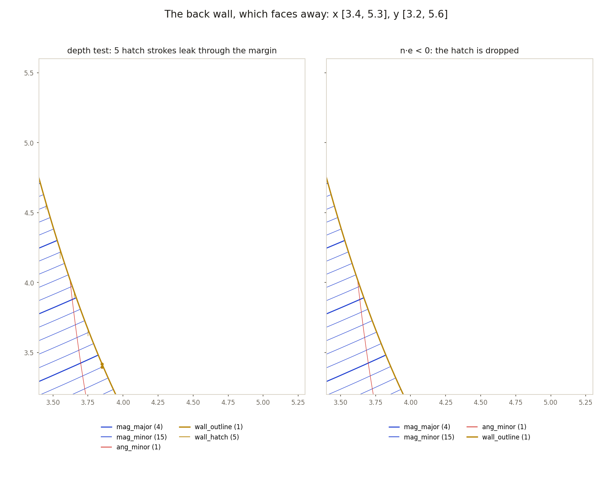
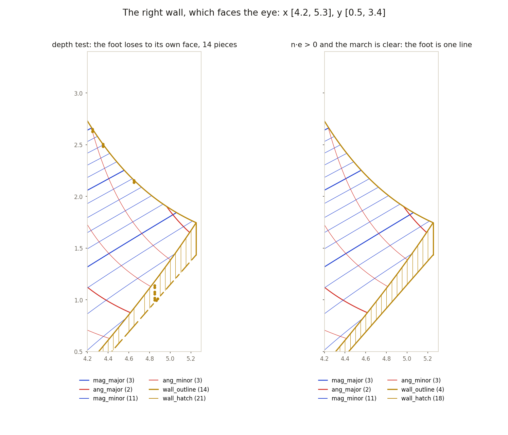
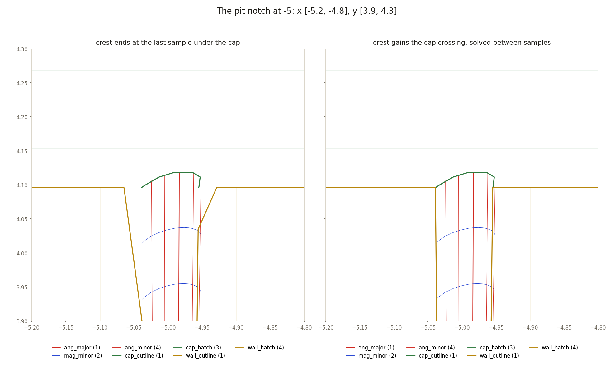
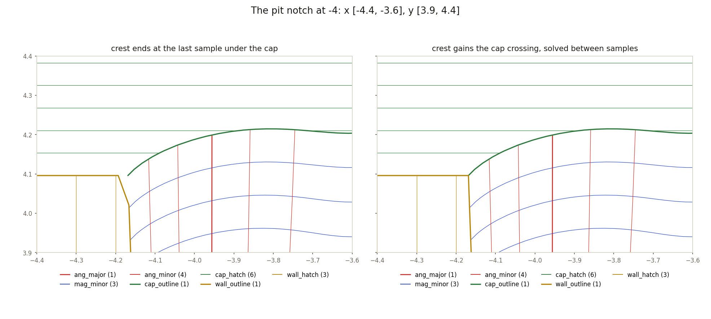

# Wall ink on the wall-ink branch

Two commits, merged as PR 11, each fixing a different thing about the cut
faces of a landscape. The first replaces the visibility test for ink lying
in a wall. The second moves a vertex of the wall's crest. They share a
branch and nothing else, and the figures are grouped by commit.

Every figure is drawn by [`figures.py`](figures.py) from the two bakes
beside it and is remade with

    .venv/bin/python docs/wall-ink/figures.py

The bakes are the rgamma landscape at 350 samples, baked at 1000 pixels of
depth with the refiner on, as the plate is drawn: [`rgamma-pr8.svg`](rgamma-pr8.svg)
from `5e5ec61`, the state before the branch, and [`rgamma-walls.svg`](rgamma-walls.svg)
from the branch at `e138a3a`. In each figure the left panel is before and
the right panel is after. The legend counts the paths of each layer that
reach into the window, so a wall outline in fourteen pieces against one in
one piece is read off directly.

## `a642eee`: a facing test for ink in a cut face

Before, every vertex of ink was kept by the depth buffer. With $z(v)$ the
view depth of the vertex and $z_{\text{buf}}$ the depth the rasterizer
stored at its pixel, the vertex shows when

$$z(v) \ge z_{\text{buf}}(\text{pixel}(v)) - \text{margin}.$$

The plate camera sees the right and back walls nearly edge-on, where one
pixel spans the whole receding wall and keeps the near side's depth. On
such a face the test fails both ways. Ink on a wall that faces away sits
within the margin of the surface in front of it and leaks through. Ink on a
wall that faces the eye loses to its own face by more than any margin and
is dropped.

After, a vertex in a wall is kept by the wall. With $n_w$ the wall's outward
normal, $e$ the direction to the eye, and $\text{clear}(v)$ true when a
march up the sight line from $v$ meets no solid before leaving the domain,

$$\text{show}(v) = \bigl(n_w \cdot e > 0 \;\lor\; v \text{ on the crest}\bigr) \;\land\; \text{clear}(v).$$

A vertex on the crest is the surface's own edge, in plain view over a wall
that faces away, so it is judged by the march alone. A post at a corner lies
in two walls and shows if either does. This is the same march the fold
lines use, built once per camera.

The back wall has $n_w \cdot e < 0$. Five strokes of its hatch leaked
through the margin as dots and ticks along the crest. The sign test drops
every one, and the crest is whole either way.

The right wall has $n_w \cdot e > 0$. Its foot lost the depth fight with
its own face and broke into fourteen pieces; the dots are the fragments too
short to draw as lines. The facing test with the march keeps it as one
line. The hatch count falls from twenty-one to eighteen; since the facing
test keeps a facing wall's own hatch stroke for stroke, the three that go
were leaked from elsewhere.

## `e138a3a`: the crest carried to the cap

The crest of a cut face is the surface's profile along the tile edge,
sampled once per cell and clamped at the cap. Between the last sample under
the cap and the first at it, the stroke ran straight to the cap, a sample
late. The rim it should meet is a contour, placed at the exact crossing
between samples, so at every pit notch the rim's end hung in the air a
fraction of a cell past the crest.

The crest now gains a vertex wherever the uncapped height $h$ crosses the
cap $c$ between consecutive samples $h_i < c \le h_{i+1}$, at the linear
crossing

$$t = \frac{c - h_i}{h_{i+1} - h_i},$$

the same arithmetic the rim contour uses, in both the Swift and the Python
wall outline operation for operation, so the hatch fixtures still hold the
two to the bit. On rgamma every rim end on the front edge coincides with a
crest vertex to rounding. No visibility is involved: the same strokes are
drawn, with one more vertex each.

## Reading the bakes

The bake writes each layer as one anonymous `<g>` in the order the landscape
declares its layers, with the fold-line layer last, and a single transform on
the outer group flips the plate's y for the page. The script names the groups
by that order and reads the points as plate coordinates. A bake with a
different layer set needs its own `LAYERS` list.
